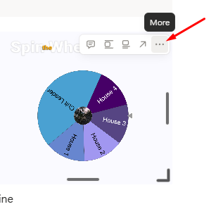

# TS4 - Diffy Cult Challenge

---

---

<aside>
👑

**Current Gen**:

[Gen 1 — The Believer](https://www.notion.so/Gen-1-The-Believer-28feed3eb831801789b8d0f1d475d998?pvs=21)

</aside>

[https://thesimstree.com/](https://thesimstree.com/)

---

<aside>
☸️

# Quick Links

<aside>
▶️

[Dashboard](https://www.notion.so/TS4-Diffy-Cult-Challenge-28ceed3eb83180f5b0f0f4e031163a32?pvs=21)

</aside>

<aside>
♾️

[Generations](https://www.notion.so/Generations-28deed3eb8318072b52ecab4abfdfe75?pvs=21)

</aside>

<aside>
⚖️

[**Balances**](https://www.notion.so/Balances-28deed3eb83180499a96f5efdb2c127e?pvs=21)

</aside>

<aside>
📜

[**Rules/Lore**](https://www.notion.so/Rules-Lore-28deed3eb83180b1965afd46279ad482?pvs=21)

</aside>

<aside>
📌

[**Extra links**](https://www.notion.so/Extra-Links-28deed3eb831804ebeb3cf77a7f9699a?pvs=21)

</aside>

</aside>

---

[Untitled](Untitled%2028ceed3eb831808db087d2273d20badc_Soul%20Points%20-%20Quick%2028ceed3eb831804787b2000bc9bd0b11.csv)

---

<aside>
☸️

# Wheels of Fate

</aside>

- Update the link in the embed to your household.
    
    
    
    
    
    
    
- ‼️ Each heading has its own link and embedded wheel
    - It is a good idea to replace the Pop-Corn House one as you go.
        - Must have one Adult or younger in the household to qualify
    

---

<aside>
🍿

# Pop-Corn House

## [Click](https://spinthewheel.app/ig880Od4ZF) to edit your own.

[https://spinthewheel.app/ig880Od4ZF](https://spinthewheel.app/ig880Od4ZF)

</aside>

<aside>
☸️

# Life and Death

# Rebirth

When someone dies who is not the main sim, spin this wheel

## [Click](https://spinthewheel.io/wheels/zoZT4VcexBx1JENZKbkucz0xJmU9MQ==) to edit your own.

[https://www.notion.so](https://www.notion.so)

# The Great Reckoning

Use this spinner to decide what happens at the [Great Reckoning](https://www.notion.so/The-Great-Reckoning-28deed3eb83180999f4fd21e2fe9e2ad?pvs=21).

## [Click](https://spinthewheel.io/wheels/zoZT4VcexBx1JENZKbkucz0xJmU9MQ==) to edit your own.

[https://www.notion.so](https://www.notion.so)

</aside>

<aside>
🪩

# Soul Points

# Tier 1

Minor infractions, internal solutions

**3-6 SP**

## [Click](https://spinthewheel.app/LrznvN0Agk) to edit your own.

[https://spinthewheel.app/LrznvN0Agk](https://spinthewheel.app/LrznvN0Agk)

# Tier 2

Major Infractions, external problems

**7+ SP**

## [Click](https://spinthewheel.app/D2Rm6GFNNE) to edit your own.

[https://spinthewheel.app/D2Rm6GFNNE](https://spinthewheel.app/D2Rm6GFNNE)

# Blessings

During the weekly Roundup and you have 2 or less points

## [Click](https://spinthewheel.app/nYgtXQ4KzF) to edit your own.

[https://spinthewheel.app/nYgtXQ4KzF](https://spinthewheel.app/nYgtXQ4KzF)

</aside>

---

<aside>

# [The Great Reckoning](https://www.notion.so/The-Great-Reckoning-28deed3eb83180999f4fd21e2fe9e2ad?pvs=21)

## 0/10 weeks

(*Put the day of the week you are using here as a reminder for future you*)

Make sure to manually update each week

</aside>

## Tips & Reminders

### [Balance](https://www.notion.so/Balances-28deed3eb83180499a96f5efdb2c127e?pvs=21) Sheet / Money

- Use to keep track of money cheats
    - See rules for further explanation

### Scoring Summary

> Earning Shadow Points
> 
- **+1** Missed sunrise meditation
    - Every morning between 5am and 7am you must meditate
- **+1** Negative Emotion for more than 6 in-game hours
- **+1** Yells, insults, or fights with any sim
- **+1** Breaks vegetarian rule
- **+1** Death of a sim on cult property
- **+2** Death of a follower
- **+2** Cancels a wellness class mid-session
- **+2** Completing “[Week of Penance](https://www.notion.so/Week-of-Penance-28feed3eb8318032a9b9e26af36e48bb?pvs=21)” for an heir **dying as just a** **cult member** (follower / initiate)
- **+3** Accepts a career
    - Exception for aspirations that require a career (See rules for further explanation)
- **+3** Uses vampire powers or dark magic
- **+3** for taking over a cult social group with a cheat
- **+3** for losing your heirs soul
- **+3** completing “[Week of Penance](https://www.notion.so/Week-of-Penance-28feed3eb8318032a9b9e26af36e48bb?pvs=21)” for an heir **dying while exiled** (outside of Gen 7)
- **+3** for any goals not achieved for that generation at the time of the heirs passing

> Cleansing Shadow Points
> 
- **-1** 3-hour meditation alone
- **-1** completing “Week of Penance” for **lost heir**
- **- 1** write in your journal about “truth” or “guilt”
- **-2** Donate §2,000 to balance sheet
- **-2** gain a [Spirit Guide](https://www.notion.so/Spirit-Guide-28feed3eb83180658e6be12252b44062?pvs=21)
- **-2** completing “Week of Penance” for **dying as Acting Cult Leader** as heir
- **-2** Achieve peace through The Great Reckoning spin
- **-3** Complete a yoga or meditation aspiration milestone
- **Reset** [(Penance Retreat](https://www.notion.so/Penance-Retreat-Rule-28deed3eb83180cdaa8ef686559e96d2?pvs=21))
    - Spend 24 sim hours

<aside>
📝

## Weekly Checklist

<aside>
📌

Pick one day each sim week (like Friday) to complete these tasks

</aside>

- [ ]  Tally up Shadow Points
    - <3 Spin a **Blessing**, Good Job!
    - 3-6 points spin the [**Tier 1**](https://spinthewheel.app/LrznvN0Agk) Penance wheel
    - 7+ points spin the [**Tier 2**](https://spinthewheel.app/D2Rm6GFNNE) Penance wheel
        - You cannot go below 0
        - Negative Balances do not carry over into the new week
        - *Delete entries when managed*
- [ ]  Check your Clubs and add SPs accordingly
- [ ]  In Gen 4-6 Spin the popcorn wheel to see where you go next

</aside>

[Resources](https://www.notion.so/Resources-28deed3eb831808fa8a8d40253e599a6?pvs=21)

[https://www.notion.so](https://www.notion.so)