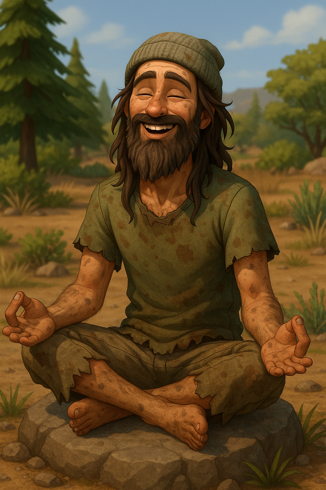

# Gen 1 — The Believer

<aside>

> The Founder must build a solid foundation of faith.
> 
</aside>

---

- Rags to Riches playthrough
- At the end of your life assign an heir
    - They will not be your main focus in Gen 2, but will need to be in the same household
    - Easiest with Enchanted by Nature
        - if you do not have that pack, sub for a trait of your choice, good luck on hardmode!

### Date of Creation

<aside>
 May 19, 2025

</aside>

(add a profile Picture)

**General Personality:**

- **Vibe**
    - Earnest, radiant and a little naive
    - Dresses like a yoga influencer with dirt under their nails
- **in CAS**
    - natural fabrics, tans and whites
    - wide eyes and hopeful smile
    - Boho / hippy
- **Personality**
    - speaks in aphorisms
    - journals constantly
    - believes every stranger might be a disciple
- **In world tone**
    - every action feels like ritual
        - its all connected to some “greater good”

# Goals

- [ ]  Money
    - [ ]  Begin with on an empty lot § 0
    - [ ]  maintain § 50,000 before death
- [ ]  Have the following traits
    - [ ]  Creative / Self-Absorbed / Mystical
- [ ]  Aspirations
    - [ ]  Wellness Guru or Zen Master
- [ ]  Faith Infrastructure
    - You must fill all three social groups entirely with your own followers
        - No sim may belong to more than one group.
        - If a member dies, replace them immediately to keep the faith.
    
    > After Leaders death any open spots in the clubs count as +1 shadow point per week.
    > 
- Leaders may never hold traditional careers; their time belongs entirely to the creed and its followers
    - grow or craft essentials
    - YOU CANNOT SELL OUT OF INVENTORY!

<aside>
 **C H A R A C T E R   B I O**

Name:

Nickname(s): 

Pronouns:

Age:

Birthday:

Sexuality:

Religion/beliefs:

Aspiration/Job: 

Current Location: 

Origin Location:

Role in story:

Background: 

Any other details :

</aside>

<aside>
 **PLAYLIST**

</aside>

[https://www.notion.so](https://www.notion.so)

(link your SimsTree Here)

---

(Images can be replaced)

- Family Members:
    - Parents:
    - Sister(s):
    - Brother(s):
- Love interests:
    - 
    - 
- Enemies:
    - 
    - 
    - 
- Relationships:
    
    Friends:
    
    Partner:
    

<aside>
🔱

 **Navigation**

[Dashboard](Gen%201%20%E2%80%94%20The%20Believer%2028feed3eb831801789b8d0f1d475d998.md)

[Generations](Generations%2028deed3eb8318072b52ecab4abfdfe75.md)

[Balances](https://www.notion.so/Balances-28deed3eb83180499a96f5efdb2c127e?pvs=21)

[Extra Links](https://www.notion.so/Extra-Links-28deed3eb831804ebeb3cf77a7f9699a?pvs=21)

[Rules and Lore](https://www.notion.so/Rules-Lore-28deed3eb83180b1965afd46279ad482?pvs=21)

</aside>