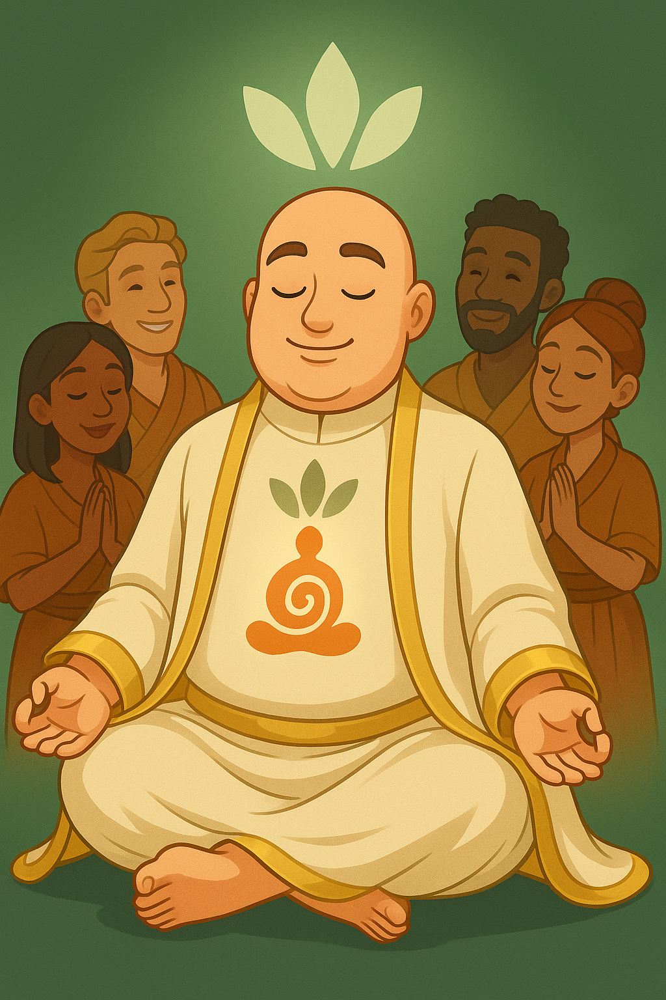

# Gen 4 — The Opulent

> The world no longer waits for the Leader’s voice.
> 
- 🍿 [Pop‑Corn Phase](https://www.notion.so/Pop-Corn-Phase-28deed3eb831803ab12fcb29428100f6?pvs=21)
    
    The win condition is to maintain harmony and relationships among the multiple splinter households while keeping the cult intact
    

### Date of Creation

<aside>
 May 19, 2025

</aside>

(add a profile Picture)

**General Personality:**

- **Vibe**
    - immaculate chaos
- **In CAS**
    - luxury maximalism
    - Silk PJs at brekkie
- **Personality**
    - laughs too loudly at family dinners
    - posts inspirational quotes while fighting in the comments
- **In-world tone**
    - Gilded shrines, empty hearts

# Goals

- [ ]  Money
    - [ ]  You cannot move off of the Cults land or downgrade in any way
- [ ]  Aspirations
    - [ ]  Big Happy Family
- [ ]  Faith Infrastructure
    - You must fill all three social groups entirely with your own followers
        - No sim may belong to more than one group.
        - If a member dies, replace them immediately to keep the faith.
    
    > Any open spots in the clubs count as +1 shadow point per week.
    > 
- Leaders may never hold traditional careers; their time belongs entirely to the creed and its followers
    - grow or craft essentials
    - YOU CANNOT SELL OUT OF INVENTORY!

<aside>
 **C H A R A C T E R   B I O**

Name:

Nickname(s): 

Pronouns:

Age:

Birthday:

Sexuality:

Religion/beliefs:

Aspiration/Job: 

Current Location: 

Origin Location:

Role in story:

Background: 

Any other details :

</aside>

<aside>
 **PLAYLIST**

</aside>

[https://www.notion.so](https://www.notion.so)

[https://www.notion.so](https://www.notion.so)

(You could link your SimsTree Here)

---

(Images can be replaced)

- Family Members:
    - Parents:
    - Sister(s):
    - Brother(s):
- Love interests:
    - 
    - 
- Enemies:
    - 
    - 
    - 
- Relationships:
    
    Friends:
    
    Partner:
    

<aside>
🔱

 **Navigation**

[Dashboard](https://www.notion.so/Gen-1-The-Believer-28deed3eb831804c8e46d7b9bf9765e3?pvs=21)

[Generations](Generations%2028deed3eb8318072b52ecab4abfdfe75.md)

[Balances](https://www.notion.so/Balances-28deed3eb83180499a96f5efdb2c127e?pvs=21)

[Extra Links](https://www.notion.so/Extra-Links-28deed3eb831804ebeb3cf77a7f9699a?pvs=21)

[Rules and Lore](https://www.notion.so/Rules-Lore-28deed3eb83180b1965afd46279ad482?pvs=21)

</aside>