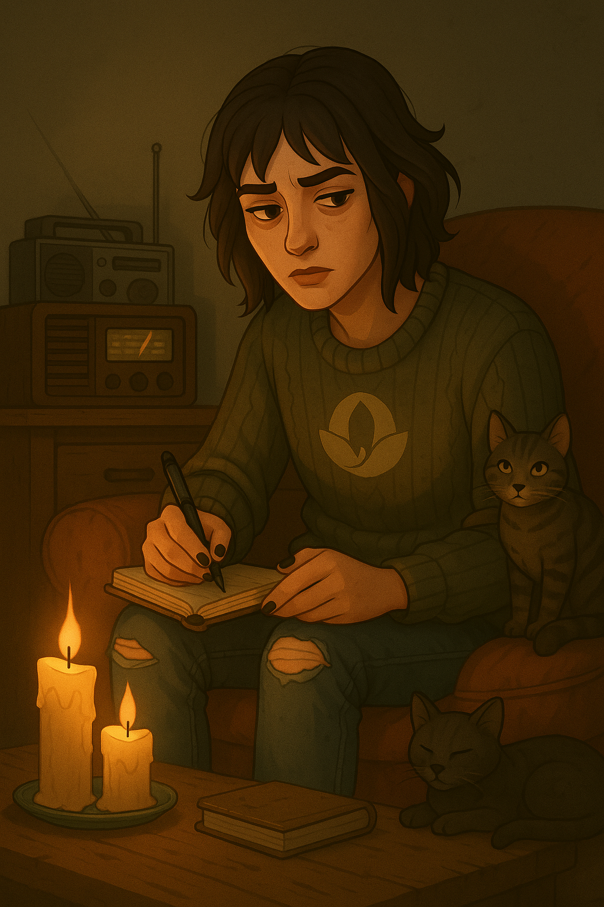

# Gen 7 — The Outcast

> “If they can’t handle me at my worst, they can’t have me at my best!”
> 

### Date of Creation

<aside>
 May 19, 2025

</aside>

(add a profile Picture)

**General Personality:**

- Vibe
    - soft grunge hermit
- In CAS
    - worn sweaters, notebooks, chipped nail polish
- Personality
    - cynical but creative
    - confides in stray cats
- In-World Events
    - Surrounds self with books, candles, and cats

# Goals

- [ ]  Money
    - [ ]  As you are not a leader you are not bound by the Leader rules HOWEVER;
        - [ ]  the only jobs you can have:
            - [ ]  Author
            - [ ]  Streamer
            - [ ]  Vlogger or modded Podcaster
    - [ ]  Publish 3 books about the cult
- [ ]  Have the following traits
    - [ ]  Creative / Cat Lover / Grouch
- Social Interactions
    - You cannot interact with the cult in any way.
        - In doing so, you must do a penance retreat immediately following
        - You can only leave your house once a week
- Faith Infrastructure
    - You are not bound by this at this time
        - Leave or Disband the groups
            - They will be used again later
            - I recommend passing them to the active leader

<aside>
 **C H A R A C T E R   B I O**

Name:

Nickname(s): 

Pronouns:

Age:

Birthday:

Sexuality:

Religion/beliefs:

Aspiration/Job: 

Current Location: 

Origin Location:

Role in story:

Background: 

Any other details :

</aside>

<aside>
 **PLAYLIST**

</aside>

[https://www.notion.so](https://www.notion.so)

[https://www.notion.so](https://www.notion.so)

(link your SimsTree Here)

---

(Images can be replaced)

- Family Members:
    - Parents:
    - Sister(s):
    - Brother(s):
- Love interests:
    - 
    - 
- Enemies:
    - 
    - 
    - 
- Relationships:
    
    Friends:
    
    Partner:
    

<aside>
🔱

 **Navigation**

[Dashboard](https://www.notion.so/Gen-1-The-Believer-28deed3eb831804c8e46d7b9bf9765e3?pvs=21)

[Generations](Generations%2028deed3eb8318072b52ecab4abfdfe75.md)

[Balances](https://www.notion.so/Balances-28deed3eb83180499a96f5efdb2c127e?pvs=21)

[Extra Links](https://www.notion.so/Extra-Links-28deed3eb831804ebeb3cf77a7f9699a?pvs=21)

[Rules and Lore](https://www.notion.so/Rules-Lore-28deed3eb83180b1965afd46279ad482?pvs=21)

</aside>