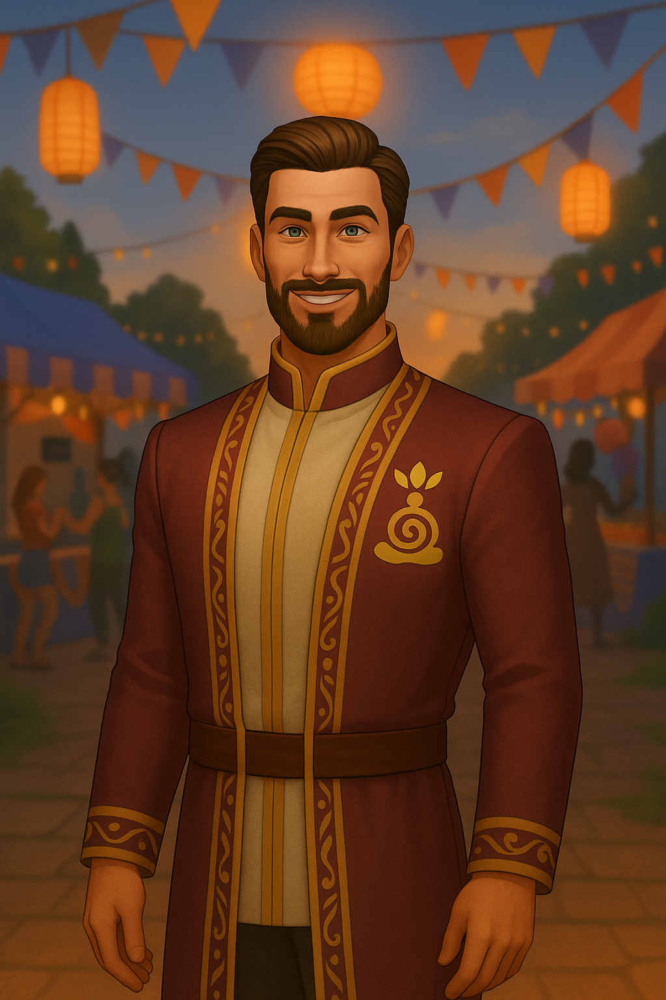

# Gen 9 — The Pilars

> Revives rituals in modern form, blends tech and mysticism
> 

### Date of Creation

<aside>
 May 19, 2025

</aside>

(add a profile Picture)

**General Personality:**

- **Vibe:**
    - the polished politician of belief.
- **In CAS:**
    - tailored tradition—ceremonial wear adapted for power meetings
- **Personality:**
    - disciplined, benevolent control-freak.
- **In-world:**
    - festivals choreographed to look spontaneous.

# Goals

- [ ]  Higher Education
    - [ ]  Obtain Communications or Political Science Degree
    
    [unchecked](data:image/png;base64,iVBORw0KGgoAAAANSUhEUgAAAEgAAABICAYAAABV7bNHAAAA1ElEQVR4Ae3bMQ4BURSFYY2xBuwQ7BIkTGxFRj9Oo9RdkXn5TvL3L19u+2ZmZmZmZhVbpH26pFcaJ9IrndMudb/CWadHGiden1bll9MIzqd79SUd0thY20qga4NA50qgoUGgoRJo/NL/V/N+QIAAAQIECBAgQIAAAQIECBAgQIAAAQIECBAgQIAAAQIECBAgQIAAAQIECBAgQIAAAQIEyFeEZyXQpUGgUyXQrkGgTSVQl/qGcG5pnkq3Sn0jOMv0k3Vpm05pmNjfsGPalFyOmZmZmdkbSS9cKbtzhxMAAAAASUVORK5CYII=)
    
    - Optional - Join Politician Career
        
        [unchecked](data:image/png;base64,iVBORw0KGgoAAAANSUhEUgAAAEgAAABICAYAAABV7bNHAAAA1ElEQVR4Ae3bMQ4BURSFYY2xBuwQ7BIkTGxFRj9Oo9RdkXn5TvL3L19u+2ZmZmZmZhVbpH26pFcaJ9IrndMudb/CWadHGiden1bll9MIzqd79SUd0thY20qga4NA50qgoUGgoRJo/NL/V/N+QIAAAQIECBAgQIAAAQIECBAgQIAAAQIECBAgQIAAAQIECBAgQIAAAQIECBAgQIAAAQIEyFeEZyXQpUGgUyXQrkGgTSVQl/qGcG5pnkq3Sn0jOMv0k3Vpm05pmNjfsGPalFyOmZmZmdkbSS9cKbtzhxMAAAAASUVORK5CYII=)
        
- [ ]  Public Face
    - [ ]  Have a significant other
    - [ ]  Have one male offspring
    - [ ]  Have one female offspring
        - Optional - have a pet
- [ ]  Aspirations
    - [ ]  Friend of the World
    - [ ]  Successful Lineage
- You must fill all three social groups entirely with your own followers
    - No sim may belong to more than one group.
    - If a member dies, replace them immediately to keep the faith.

> After Leaders death any open spots in the clubs count as +1 shadow point per week.
> 
- Leaders may never hold traditional careers; their time belongs entirely to the creed and its followers
    - grow or craft essentials
    - YOU CANNOT SELL OUT OF INVENTORY!

<aside>
 **C H A R A C T E R   B I O**

Name:

Nickname(s): 

Pronouns:

Age:

Birthday:

Sexuality:

Religion/beliefs:

Aspiration/Job: 

Current Location: 

Origin Location:

Role in story:

Background: 

Any other details :

</aside>

<aside>
 **PLAYLIST**

</aside>

[https://www.notion.so](https://www.notion.so)

[https://www.notion.so](https://www.notion.so)

(link your SimsTree Here)

---

(Images can be replaced)

- Family Members:
    - Parents:
    - Sister(s):
    - Brother(s):
- Love interests:
    - 
    - 
- Enemies:
    - 
    - 
    - 
- Relationships:
    
    Friends:
    
    Partner:
    

<aside>
🔱

 **Navigation**

[Dashboard](https://www.notion.so/Gen-1-The-Believer-28deed3eb831804c8e46d7b9bf9765e3?pvs=21)

[Generations](Generations%2028deed3eb8318072b52ecab4abfdfe75.md)

[Balances](https://www.notion.so/Balances-28deed3eb83180499a96f5efdb2c127e?pvs=21)

[Extra Links](https://www.notion.so/Extra-Links-28deed3eb831804ebeb3cf77a7f9699a?pvs=21)

[Rules and Lore](https://www.notion.so/Rules-Lore-28deed3eb83180b1965afd46279ad482?pvs=21)

</aside>