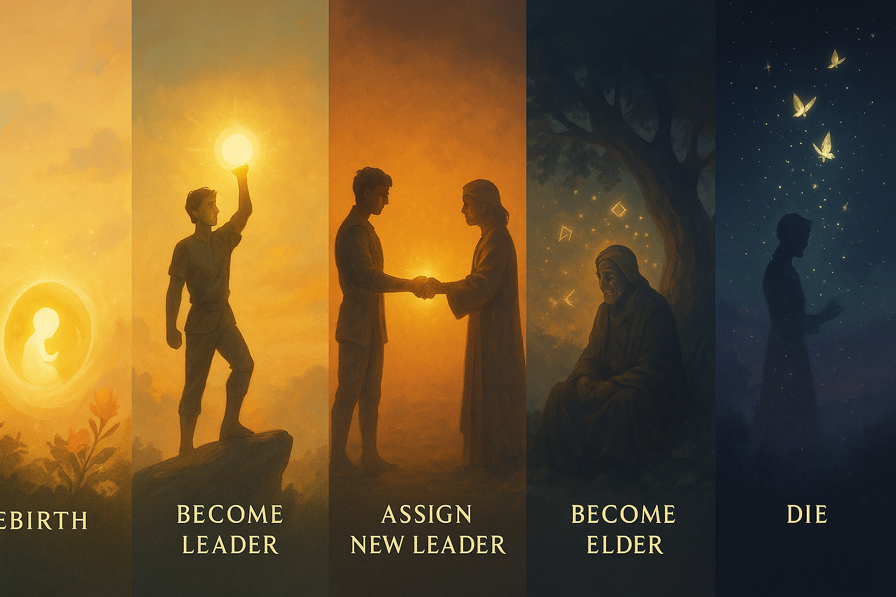

# Rules/Lore

---

<aside>
☸️

# Quick Links

<aside>
▶️

[Dashboard](https://www.notion.so/TS4-Diffy-Cult-Challenge-28ceed3eb83180f5b0f0f4e031163a32?pvs=21)

</aside>

<aside>
♾️

[Generations](https://www.notion.so/Generations-28deed3eb8318072b52ecab4abfdfe75?pvs=21)

</aside>

<aside>
⚖️

[**Balances**](https://www.notion.so/Balances-28deed3eb83180499a96f5efdb2c127e?pvs=21)

</aside>

<aside>
📜

[**Rules/Lore**](Rules%20Lore%2028deed3eb83180b1965afd46279ad482.md)

</aside>

<aside>
📌

[**Extra links**](https://www.notion.so/Extra-Links-28deed3eb831804ebeb3cf77a7f9699a?pvs=21)

</aside>

</aside>

# TS4 - Diffy Cult Legacy

                                                                             Rules and Lore

                                                                       ⚠️**Content Warning**⚠️

Themes included in this challenge may not be suitable for all ages. Themes include: High Control Groups and manipulation. Content discussed in this document can be considered triggering to some audiences.  As a general disclaimer, I will use the word “cult” synonymously with the phrase “High Control Group”.

- Required Packs
    - The [Sims 4](https://www.ea.com/en/games/the-sims/the-sims-4) Base Game
        - Enchanted By Nature
        - Life and Death
        - Getting Together
        - Business and Hobbies
            - Or [Live in Buinesses](https://lms-mods.com/) Mod
    - Honestly, you could get buy with substitutions for everything, just by going with the spirit of the lore. However, I have these packs and a few more so I will be using them.

**Note**: Some Generations' goals are to feel different aspects of High Control Groups. This may feel uncomfortable for some players. Please use your own discretion as to whether you will follow the rules or modify/skip different generations.

–This is a game, stay safe and have fun!

<aside>

# Rules

</aside>

There are several rules for this Challenge. The now popularized term “High Control Group” has become synonymous with the word “Cult”. These rules are meant to challenge the player in different aspects of high control groups, following the real trend of high control groups.

- This Challenge is split into three parts
    - Gen 1-3
    - Gen 4-6
    - Gen 7-10
- During the **middle section** you will no longer just be playing in a single household. This challenge references this section as the [Pop-Corn Phase](Pop-Corn%20Phase%2028deed3eb831803ab12fcb29428100f6.md).
- The outside sections you will be playing as your main sim.
    - The main sim should be raised in the “[Chosen Household](Chosen%20Household%2028feed3eb831805cbff3dbc18d19f9d2.md)”
    - Follow the guidelines for each generation if they differ.

There are several specific types of rules that are active throughout the entire challenge. Feel free to increase or decrease their presence in your own game play to adjust the challenge difficulty. 

---

<aside>

## Life Cycle

</aside>

1. **Rebirth**
    1. Use Pop-corn House wheel to pick the new chosen household if you did not have a [Choosing Ceremony](Choosing%20Ceremony%2028feed3eb83180a6956be37bac5abcd3.md)
        1. If more than one parent is available in the household, use your best judgement
2. **Become Leader**
    1. Rise through the ranks of the social groups to become the leader of the cult
3. **Assign [New Leader](Acting%20Cult%20Leader%2028feed3eb83180818d97fe6e86c930a1.md)**
4. **Become Elder**
    1. Use this time to finish up any goals that are left
5. **Die**
    1. Any left over goals is +3 SP

<aside>

## Rebirth and Death

</aside>

During the course of the playthrough you will be using the rebirth system from Life and Death. 

The character you start with, will be the same character you are playing in Gen 10, **you are living one continuous life** within the cult experience. 

### Life and Death Protocol for Heir

### Dies as an Elder of the Cult

This is the ideal situation.

- Have a [Choosing Ceremony](Choosing%20Ceremony%2028feed3eb83180a6956be37bac5abcd3.md)
- Spin the [Blessing Wheel](https://spinthewheel.app/nYgtXQ4KzF)
- Reset SP

### Dies as the Leader of the Cult

- Trigger a “[Week of Penance](Week%20of%20Penance%2028feed3eb8318032a9b9e26af36e48bb.md)”
    - -2 SP at its completion
- Spin Pop-Corn Household to decide on household to be born into
    - They become the [Chosen Household](Chosen%20Household%2028feed3eb831805cbff3dbc18d19f9d2.md)

### Dies as a member of the cult

- Trigger a “[Week of Penance](Week%20of%20Penance%2028feed3eb8318032a9b9e26af36e48bb.md)”
    - +2 SP at its completion
- Spin Pop-Corn Household to decide on household to be born into
    - They become the [Chosen Household](Chosen%20Household%2028feed3eb831805cbff3dbc18d19f9d2.md)

### Dies Exiled

In the event that you die exiled from the group outside Gen 7

- Trigger a “[Week of Penance](Week%20of%20Penance%2028feed3eb8318032a9b9e26af36e48bb.md)”
    - +3 SP at its completion
- Spin Pop-Corn Household to decide on household to be born into
    - They become the [Chosen Household](Chosen%20Household%2028feed3eb831805cbff3dbc18d19f9d2.md)

### Reincarnation

This is reserved for **everyone but your heir sim**. I also highly recommend recycling characters into side households to further the line instead of playing them through.

You should be keeping all tombstones and urns on the cults lot.

- If they die and have the **rebirth** ability
    - Become reborn as an infant and use the Pop-Corn household spinner to see where they land.
    - +3 SP
        - alternatively you can make them a [Spirit Guide](Spirit%20Guide%2028feed3eb83180658e6be12252b44062.md), that is up to you.
- If they die and **do not** have the rebirth ability they become a [Spirit Guide](Spirit%20Guide%2028feed3eb83180658e6be12252b44062.md)

---

<aside>

## Roles in the cult

</aside>

> You must use your social groups to create a group for **Initiates**, **Followers** and **Elders**.
> 

                                      *Feel free to name them however you wish.* 

### Cult Founder

- **Generation 1 sim**
- Not Bound by Cult Leader role regulations as they are the one who sets it up.
- Must be able to do rebirth at the end of their life
    
    If they are not able to, for whatever reason, spin the popcorn household wheel and create a new sim for that household
    
- They are able to romance any one that you choose
    - I recommend moving sims out onto their own lot as soon as they become a young adult, but thats completely up to you
        - Reminder that there is a hard cap of 20 sims on a given property in sims

### Cult Leader Requirements

Leader of the three core cult social groups

See: [Acting Cult Leader](Acting%20Cult%20Leader%2028feed3eb83180818d97fe6e86c930a1.md)

### Cult Initiate Requirements

- Age requirement: Teen - Adult
- Friendship Level: None
- Skill Levels:
    - Wellness: 2

### Cult Follower Requirements

- Age requirement: Young Adult- Adult
- Friendship Level: Good Friends with Acting Leader
- Skill Levels:
    - Wellness: Max
    - Charisma: 5
    - 1 Marketable skill at 5
        - (i.e.: painting, pottery, gardening, etc.)

### Cult Elder Requirements

- Age requirement:  Adult - Elder
- Friendship Level: Best Friends with Acting Leader or Romantic Relationship
- Skill Levels:
    - Wellness: Max
    - Charisma 5
    - 2 Marketable skill at 5
        - (i.e.: painting, pottery, gardening, etc.)
- One side cult group with at least 3 people
- **Heirs** can bypass all requirements by completing the [Choosing Ceremony](Choosing%20Ceremony%2028feed3eb83180a6956be37bac5abcd3.md)

<aside>

<aside>
🧐

## Extra Sources

</aside>

<aside>

[Soul Points](Soul%20Points%2028eeed3eb8318031a61efe61300509a9.md)

[Specific Rules](Specific%20Rules%2028eeed3eb83180c2b4d9c3c686be917d.md)

[Consequences ](Consequences%2028eeed3eb831802c85bdcd3f1bd9a7c7.md)

</aside>

<aside>

[Spirit Guide](Spirit%20Guide%2028feed3eb83180658e6be12252b44062.md)

[Choosing Ceremony](Choosing%20Ceremony%2028feed3eb83180a6956be37bac5abcd3.md)

[Pop-Corn Phase](Pop-Corn%20Phase%2028deed3eb831803ab12fcb29428100f6.md)

</aside>

</aside>